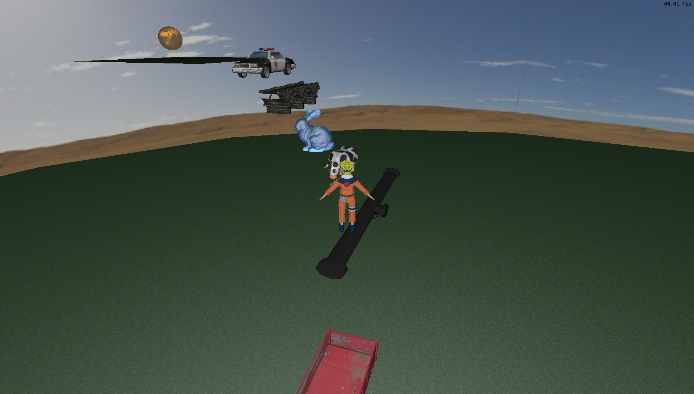
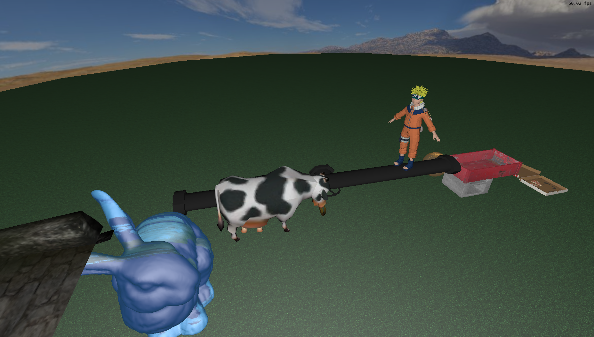
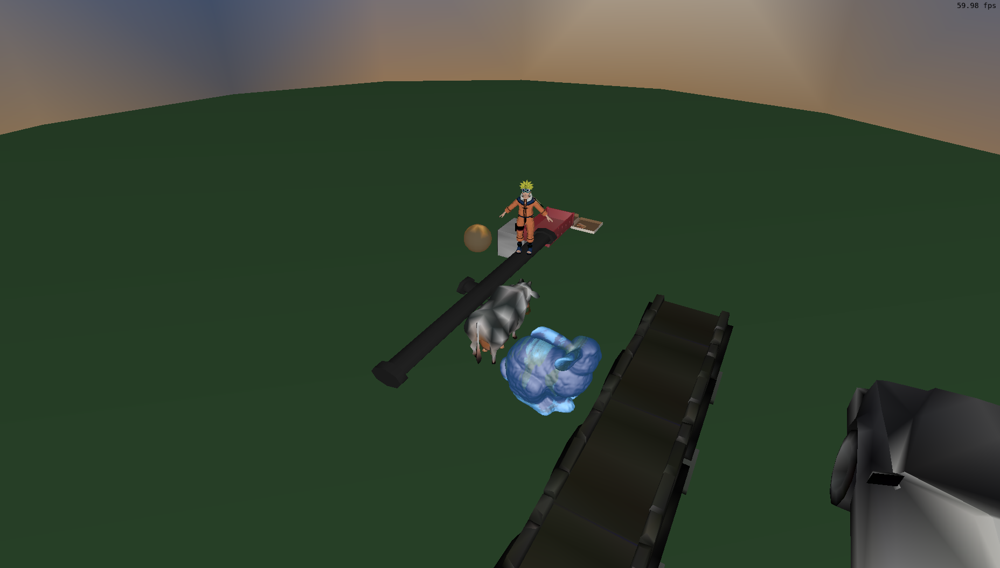
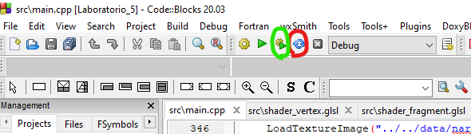

# FCG-onlyUp-game
a game based on [Only Up!](https://store.steampowered.com/app/2562240/Only_Up/) developed for computer graphics class

## Video de apresentação do jogo desenvolvido
[Video de Apresentação](https://youtu.be/RQJMtTR2cD4)

## Contribuições:

### Gustavo

Texturas, Curva bezier (animação do começo), Modelos de iluminação e interpolação, Colisão cilíndrica e esférica

### Luis Roberto

Carregar objetos na cena, camera livre e look-at, colisão bounding box, movimentação e pulo do naruto.

## ChatGPT

Nosso trabalho não usou ChatGPT ou outras ferramentas de processamento de linguagem natural

## Processo de desenvolvimento

Começamos nosso trabalho sobre o código do laboratório 5, além disso, aspectos do laboratório 4 e 2 também foram reaproveitados. A ordem dos itens abaixo é o mesmo da ordem dos críterios técnicos passados.

A maioria dos objetos da cena foram pegos do site indicado no moodle https://rigmodels.com/, também utilizamos alguns objetos disponibilizados pelo professor ao longo do semestres

boa parte dos códigos para as cameras foram os mesmos desenvolvidos no lab 2, com algumas mudanças como na look-at ela sempre focar no naruto.

As instâncias dos objetos, temos 2 planos e 2 esferas, foi usada a mesma referencia de .obj para desenhar ambos, diferente da skybox, que tem um .obj extremamente parecido, mas que usa um .mtl diferente, e logo, uma textura diferente.

A pricipal colisão é bounding box com bounding box, a bbox do personagem é testada com as bbox da maioria dos objetos para checar se houve colisão.
Além dessa, a colisão esférica que não permite que uma bounding box (bb) se aproxime de um raio dela, e uma cilíndrica que sob 2 eixos também não permite que a bb chegue perto dela, mas também no 3º eixo usa um tipo de colisão parecido com o de bb com bb.

Modelos de Iluminação difusa e de Blinn-Phong foi feito por cima do código do laboratório 4, com alterações bem básicas sob este, seguindo as intruções dos slides da aula 17 e 18. Como cada objeto importado tinha um .mtl, nesses próprios arquivos podiamos setar o Kd, Ka e Ks, mas também foram definidos usando o id do objeto dentro do código (isso ficou meio bagunçado, não tenho como negar :P), e somente o objeto do Coelho ficou com modelo de Blinn-Phong, os demais ficaram com iluminação difusa.

Modelos de Interpolação de Phong e de Gouraud foram feitos de uma maneira simples: todo o código que estava no fragment_shader, foi copiado e colado no vertex_shader, com o cálculo da cor sendo controlado por ou um ou outro, mandando um número inteiro como um booleando para escolher qual Modelo de interpolação será usado, e cabe ao usuário decidir qual. A interpolação "padrão" (a interpolação que o jogo começa) é a de Phong, e ao apertar o botão __V__ para a interpolação de Gouraud é ativada, e para voltar para a de Phong basta apertar o botão __B__.

As texturas foram botadas nos objetos que foram pegos do site usando um arquivo mtl que veio junto, enquanto que para os planos, as esferas e o coelho, foram feitos arquivos mtl auxiliares, e texturas foram selecionadas para ambos, tanto para o [chão](https://br.pinterest.com/pin/asphalt-road-texture--670825306967990404/), quanto para a [skybox](https://www.deviantart.com/macsix/art/Anvil-Spherical-HDRI-Panorama-Skybox-416317312), para as 2 outras esferas e o coelho, foi usada a textura de mapa-múndi que foi passada pelo laboratório 5.

A curva Bézier cúbica foi feita com as fórmulas do slide da aula 16. A curva foi usada para fazer a animação de inicio, essa que usa frames ao invés de segundos para controlar (não é uma animação controlada por tempo). A curva da animação usa 4 curvas bezieres cúbicas conectadas.

## Exemplos do programa

2 exemplos do visual do jogo:

exemplo de como a interpolação de Gouraud funciona

## Manual

- __W__ e __S__ para andar para frente e para trás com o Naruto, respectivamente;

- __A__ e __D__ para rotacionar o Naruto no sentido anti-horário e horário respectivamente;

- __SPACEBAR__ para pular com o Naruto;

- __F__ para usar a free camera;

- __L__ para usar a camera look-at;

- __V__ para usar o modelo de interpolação de Gouraud;

- __B__ para usar o modelo de interpolação de Phong;

- __H__ para esconder/mostrar os frames por segundo na tela;

- __Setinhas__ para controlar a free camera;

- __MOUSE__ + __BOTÃO ESQUERDO DO MOUSE__ para controlar a free camera;

## Como Compilar e Executar

### Windows

Instalar [Code::Blocks](https://www.codeblocks.org/downloads/binaries/), abrir o arquivo 'Laboratorio_5.cbp' com Code::Blocks. Em seguida, apertar o das setas azuis (marcado na figura abaixo em vermelho), e em seguida, no botão marcado de uma ingrenagem com um triângulo (marcado na figura abaixo em verde). Seguindo esses passos, o jogo deve estar rodando (para rodar novamente, basta apertar no botão marcado em verde).

### Linux

Para compilar e executar este projeto no Linux, primeiro você precisa instalar
as bibliotecas necessárias. Para tanto, execute o comando abaixo em um terminal.
Esse é normalmente suficiente em uma instalação de Linux Ubuntu:

    sudo apt-get install build-essential make libx11-dev libxrandr-dev \
                         libxinerama-dev libxcursor-dev libxcb1-dev libxext-dev \
                         libxrender-dev libxfixes-dev libxau-dev libxdmcp-dev

Se você usa Linux Mint, talvez seja necessário instalar mais algumas bibliotecas:

    sudo apt-get install libmesa-dev libxxf86vm-dev

Após a instalação das bibliotecas acima, você possui várias opções para compilação:

--- Linux com Makefile
-------------------------------------------
Abra um terminal, navegue até a pasta "Laboratorio_0X_Codigo_Fonte", e execute
o comando "make" para compilar. Para executar o código compilado, execute o
comando "make run".

--- Linux com CMake
-------------------------------------------
Abra um terminal, navegue até a pasta "Laboratorio_0X_Codigo_Fonte", e execute
os seguintes comandos:

    mkdir build  # Cria diretório de build
    cd build     # Entra no diretório
    cmake ..     # Realiza a configuração do projeto com o CMake
    make         # Realiza a compilação
    make run     # Executa o código compilado